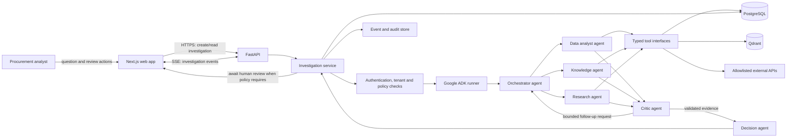
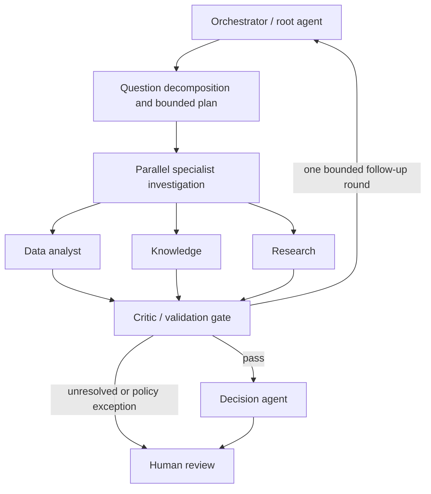

# System Architecture

## Scope

Enterprise Decision Intelligence investigates procurement questions by combining structured operational data, internal documents, and approved external sources. It returns a decision brief whose material claims link to inspectable evidence. The first vertical is procurement and cost intelligence.

The system is read-only during an investigation. Creating or changing a purchase order, contacting a supplier, or publishing information outside the requesting tenant is out of scope unless a separately authorized human action is introduced.

## System Context



The diagram represents logical ownership, not a deployment topology. PostgreSQL is the system of record for investigations, evidence metadata, and audit records. Qdrant is a planned retrieval index; source documents remain in controlled object/document storage. ADK session state is working memory, not the durable audit record. The Knowledge agent and document index are not considered ready until the document-onboarding milestone is complete.

## Data Onboarding and Readiness

Reference contracts, procurement policies, and supplier documents will be added in a later project step. The current repository does not assume those source files or an indexed corpus already exist; the document request/result types define the future integration boundary only. Do not add placeholder documents or produce citations to sources that have not been ingested.

Before enabling document-backed investigation, an ingestion pipeline must register source ownership and tenant scope, supplier/document type, effective dates, source version, content hash, access policy, and ingestion status. It must preserve the original source in controlled storage, report parse/ingestion failures, and support updates or removals. Retrieval readiness requires a successful ingestion check and a tested citation locator back to the source.

Document search has three distinct outcomes:

- An unconfigured or not-yet-ingested corpus returns a `SOURCE_NOT_CONFIGURED` tool error; this is not an empty search result.
- A configured corpus with no relevant matches returns success with an empty document list and the searched corpus version.
- An unavailable or failed retrieval service returns a normalized tool error, with retryability set by the adapter.

Until the Knowledge path is ready, questions that require contract/policy evidence must be reported as incompletely investigated with an explicit evidence gap. The system must not substitute generated text or general model knowledge for missing source documents.

## Agent Hierarchy



The Orchestrator owns routing and workflow progression. It may dispatch independent read-only investigations concurrently. The Critic is a required gate before synthesis. Permit at most one follow-up round in the initial implementation; if evidence remains insufficient, return an explicit limitation for human review rather than looping indefinitely. The Decision agent cannot call data tools or override a Critic rejection.

## Responsibilities and Boundaries

| Component | Owns | Must not own |
| --- | --- | --- |
| Next.js | Question entry, progress/events, evidence inspection, review actions | Credentials for data stores, agent logic, direct database access |
| FastAPI and investigation service | Authentication, tenant isolation, request validation, lifecycle, SSE, persistence, policy enforcement | LLM-generated business calculations |
| Orchestrator | Task decomposition, delegation, budgets, state transitions, retry decision | SQL, retrieval implementation, final unsupported claims |
| Data analyst | Structured-data questions and deterministic spend/trend calculations | Raw database connections or unrestricted SQL construction |
| Knowledge agent | Finding relevant internal documents and cited passages | Treating retrieved text as policy truth without provenance |
| Research agent | Querying allowlisted external sources and reporting their timestamps/coverage | Arbitrary web browsing, credentials, or asserting external data is current without timestamps |
| Critic | Verify claim-to-evidence support, conflicts, sufficiency, and required follow-up | Rewriting the answer to hide uncertainty or acting as an independent answer generator |
| Decision agent | Synthesize validated findings into facts, assessment, recommendation, and uncertainty | Adding facts, creating evidence, or bypassing review gates |
| Tool adapters | Input validation, bounded access, deterministic operations, provenance, normalized errors | Deciding agent workflow or returning secrets/raw connection details |

All data access goes through tools. Tool adapters receive a scoped `ToolContext`; they enforce tenant filters and query/source allowlists. Agents receive the minimum evidence needed for their task. A model-produced tool argument is untrusted input.

## Tool Contracts

Framework-independent request and result types live in `src/ai_template_python/contracts.py`. ADK tool wrappers translate between those types and ADK's invocation format; domain services do not import ADK.

| Tool | Input | Output | Required guarantees |
| --- | --- | --- | --- |
| Spend analysis | Date range, optional supplier/category, grouping | Period totals, currency, row counts | Parameterized/allowlisted query, tenant scope, explicit currency and date range |
| Document search | Query, allowed document types, optional supplier, result limit | Corpus version and matching document IDs, titles, excerpts, locators, source versions, relevance | Tenant-scoped retrieval, source access check, stable citations, explicit unconfigured/empty/error outcomes |
| Market series | Allowlisted series ID and date range | Dated values, unit, source, retrieval timestamp | Source allowlist, timeout, freshness/coverage metadata, normalized errors |
| Variance analysis | Baseline/current decimal amounts and currency | Absolute and percentage change | Deterministic decimal arithmetic, reject zero baseline for percentage, no LLM arithmetic |

Every tool returns a typed success result with evidence references or a normalized error (`code`, safe message, retryable). It must not return credentials, connection strings, unrestricted SQL, or undocumented free-form agent state. External and document evidence records include enough provenance to reproduce the lookup (source, locator, version/time, and content hash where applicable).

## Shared Investigation State

The canonical working-state schema and factory live in `src/ai_template_python/state.py`. State is JSON-serializable and versioned. It contains the request, status, bounded task plan, findings, evidence pointers, event IDs, unresolved questions, approval records, and optional decision brief. Large document bodies, database rows, credentials, and full tool payloads stay out of shared state; persist them in their owning stores and put references in state.

ADK session state is scoped deliberately: tenant/user identity is established by the API, never inferred from a prompt. The orchestrator is the only writer of workflow status and task transitions. Specialists return typed results/events; a deterministic service applies updates. This prevents parallel agents from racing while mutating one shared dictionary. Persist state transitions and audit events durably before emitting them to the client.

State is not trusted merely because it came from an agent. Validate schema version, ownership, evidence references, enums, and transition legality at each boundary. Do not place secrets or unnecessary personal data in prompts or state.

## Human-in-the-Loop

Read-only analysis does not pause for approval by default. Human review is mandatory when:

1. A user requests a consequential action (purchase-order change, supplier communication, approval/rejection, or other write). The initial product does not execute that action; a future action service must require explicit confirmation and authorization.
2. The Critic finds material evidence conflict, required evidence is missing, claims remain unsupported after the bounded follow-up round, or a material finding remains low-confidence.
3. A decision exceeds a configured materiality/risk threshold or policy requires a named approver.
4. Data or a resulting brief would cross tenant boundaries or be externally disclosed.

The investigation enters `awaiting_human` with a typed approval request, reason, and referenced evidence. Review decisions record actor, timestamp, outcome, and rationale. Approval is scoped to the exact action/version reviewed; it is not blanket authorization for future actions. Rejection or timeout returns a safe non-action outcome. The web app can display and submit review decisions, but authorization is enforced by FastAPI.

## API and Events

Initial API surface:

```text
GET  /health
GET  /ready
POST /api/v1/investigations
GET  /api/v1/investigations/{investigation_id}
GET  /api/v1/investigations/{investigation_id}/events
POST /api/v1/investigations/{investigation_id}/approvals
```

The create endpoint returns an investigation ID and status. Events use SSE with stable event IDs and typed event names (status, agent started/completed, tool started/completed, finding, approval required, decision ready, error). Reconnection uses the last event ID. Events are persisted before delivery; reconnecting clients must be able to replay them. Do not stream hidden chain-of-thought; expose concise task/status summaries, tool names, and evidence references.

## Initial Operational Guardrails

- Read-only tools; tenant-scoped access and allowlisted queries/sources.
- Bounded task count, tool-call budget, deadlines, and one follow-up round.
- Tool-specific timeouts and normalized errors; no unbounded retries.
- Evidence required for material factual findings; distinguish facts, assessment, and recommendations.
- Audit records for state transitions, tool execution metadata, evidence references, and human review.
- Structured logs and traces use investigation/correlation IDs; never log credentials or raw sensitive documents by default.
- Evaluate correctness, evidence support, citation integrity, tool selection, trajectory, latency, and cost before production rollout.